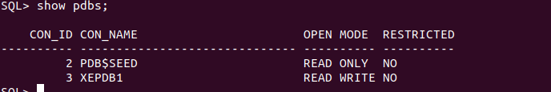

### Tem por Objetivo doumentar a Jornada de Instalar o application server Weblogic

#

### Documentação

[Central de Downloads Oracle](https://edelivery.oracle.com/osdc/faces/SoftwareDelivery)

#

### Componentes Weblogic
#
### Coherence 
> É uma camada de cache distribuida integrada ao weblogic ou FMW.
- É compartilhada entre os managed no domínio e evita que haja recomputação.
- [Documentação Coherence](https://www.oracle.com/java/coherence)
- [Coherence- Weblogic](https://uanscarvalho.com.br/coherence-o-que-e-caracteristicas-e-beneficios/)


### Preparando ambiente

- [sdkMan](https://sdkman.io/install/) - Permite instalar versões java de forma mais simplificada
- Instalação sem interface
  > Apartir da versão 12c não aceita flag -mode=console, usar modo silent

[Criar arquivo Silent](https://docs.oracle.com/middleware/1212/core/OUIRF/response_file.htm#OUIRF391)

- comando de instalação:

```shell
java -jar fmw_12.2.1.4.0_infrastructure.jar -silent -responseFile /u01/software/weblogic/silent.xml -invPtrLoc /u01/software/weblogic/oraInst.loc
```

## Criar Domínio usando wlst

[Documentação](https://docs.oracle.com/middleware/1221/wls/WLSTG/domains.htm#CHDGAJIB)

> config.sh -mode=console não funcionou

- Scripts ficam na $MW_HOME/oracle_commom/common/bin
- Usar o wlst.sh
- Vai abrir em modo offline, passe os comandos

> template base: $MW_HOME/wlserver/common/templates/wls/wls.jar

- Use os comandos do createDomain.py

- Diretório do domínio: $MW_HOME/user_projects/domains/basicWLSDomain
- Nessa Pasta há os script de start para subir o admin

### Scripts

- **Iniciar manualmente servidor**
- Ficam dentro da pasta do domínio em /bin
- script: starManagerServers.sh <nomeServidor>
- Ser

### EM

> Para configurar o EM é necessário ter um banco de dados Oracle

- Usei o Oracle XE 21c [Link](https://docs.oracle.com/en/database/oracle/oracle-database/21/xeinl/)

OracleHome do DB : /opt/oracle/product/21c/dbhomeXE/bin/

export PATH=$PATH:/opt/oracle/product/21c/dbhomeXE/bin/

# Após ter um banco de dados

- Execute os passos do extender-em.sh na vm do weblogic, com o weblogic desligado.

# Adicionar ManagedServer

- Execute o script criarManaged.sh
- Após criar reinicie o weblogic
- No Weblogic em environment, crie uma nova machine
- Associe o server criado a ela.

### Diretórios

- Binários rcu: /u01/app-old/oracle/product/middleware/oracle_common/bin

### Comandos para conectar na database

- Antes precisa: Exportar a oracle_home e oracle_sid

```
sqlplus / as sysdba

```

```
sqlplus sys/"<senha>"@//host:1521/xepdb1 as sysdba
```

- Listar components com rcu

```
$ORACLE_HOME/oracle_common/bin/rcu -silent -listComponents

```

###WLST

- Conectar ao weblogic online

```
connect('weblogic','SENHA','t3://HOST_ADMIN:7001')
cd('/JDBCSystemResources')
ls()

```

### Restart do banco

> Na vm do banco

```shell
  lsnrctl status
  lsnrctl start
  sqlplus / as sysdba
  startup;
  show pdbs;

```

- Após show pdbs deve aparecer algo como:
  

- Verificar se há listener

```shell
 ss -lntp | grep 1521
```

- Se precisar restaurar a VM é necessário manter o mesmo host, ou alterar no arquivo de hosts do banco:
  > O banco de dados é sensível ao hostname da VM
- /opt/oracle/homes/OraDBHome21cXE/network/admin/listener.ora

Bugs:
[Malformed Medium](https://medium.com/nerd-for-tech/solving-url-protocol-exceptions-with-latest-jdk-updates-7c6c85844518)
